<div align="center">

# FormPilot Enterprise
### Active AI Agent System for Government Form Automation

[](https://python.org)
[](https://fastapi.tiangolo.com)
[](https://ai.google.dev)
[](.github/workflows/ci.yml)
[](LICENSE)

Production-grade pipeline with:
**Autonomous Multi-Agent Orchestration Engine + deterministic compliance + HITL governance + Slack + SharePoint + persistent audit trail**

</div>

---

## Why This Project Is Competitive

FormPilot is not a single prompt app. It is a complete agentic system that:

1. Extracts identity data from uploaded documents.
2. Runs deterministic compliance checks (UIDAI/GST/state consistency rules).
3. Supports Human-in-the-Loop approval/rejection for risky cases.
4. Maps fields into government application schemas.
5. Generates ready-to-submit PDFs.
6. Tracks everything in persistent workflow history and audit logs.

This architecture directly targets enterprise and government review requirements: **explainability, repeatability, and governance**.

---

## Input Assets Used In This Walkthrough

No personal data was used. These demo inputs are generated assets committed in this repository.

### Synthetic Identity Document
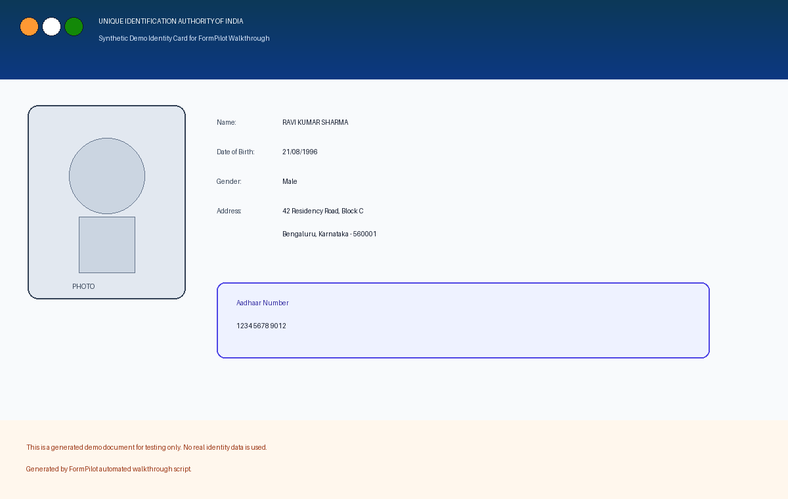

### Synthetic Government Form Template
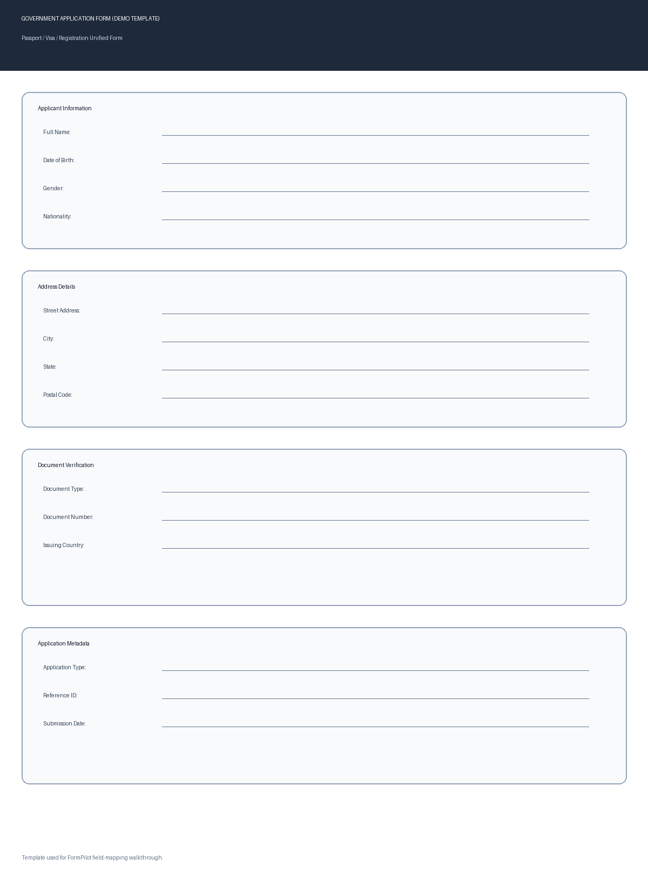

---

## End-to-End Product Walkthrough (Captured From Running App)

### 1) Landing Experience + Positioning
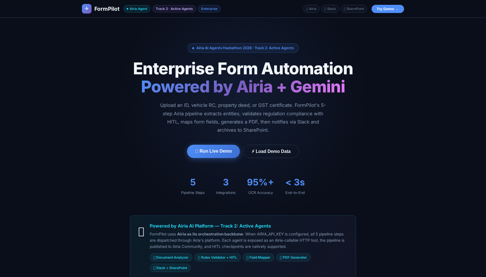

### 2) Demo Workspace + Pipeline Controls
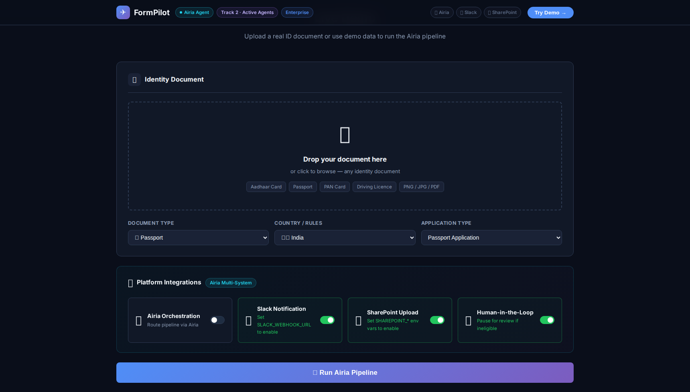

### 3) Upload Identity Document
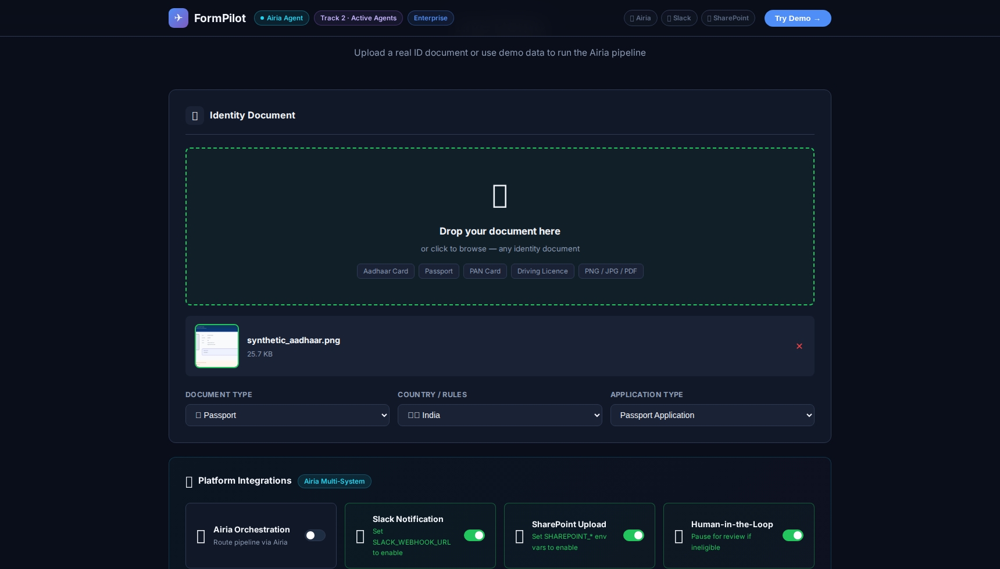

### 4) Pipeline Running (Live Progress)
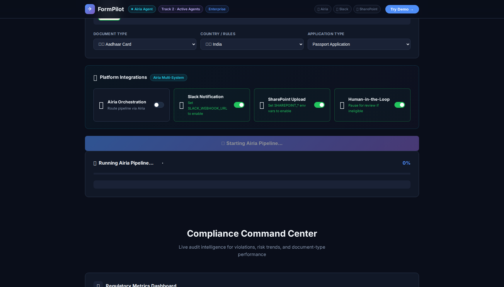

### 5) Success Flow Result (Profile + Validation + Mapping + PDF)
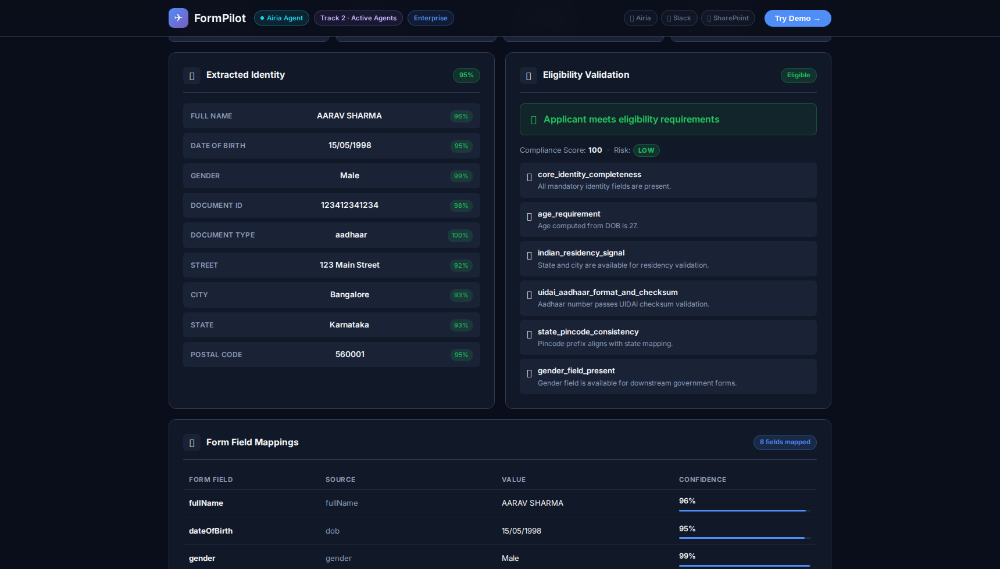

### 6) Compliance Command Center
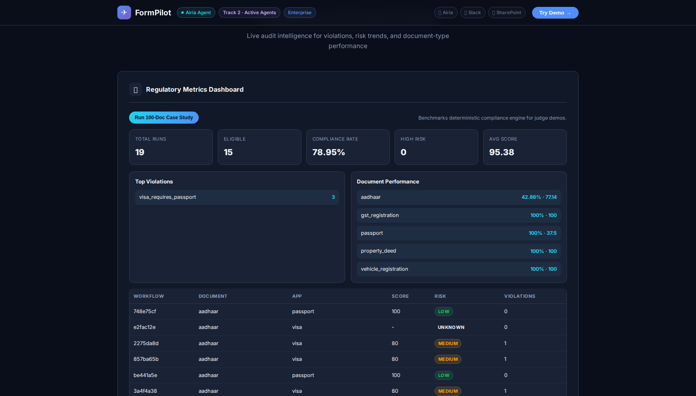

### 7) Case Study Benchmark (100-run synthetic validation)


### 8) HITL Governance Trigger (Manual Review Modal)
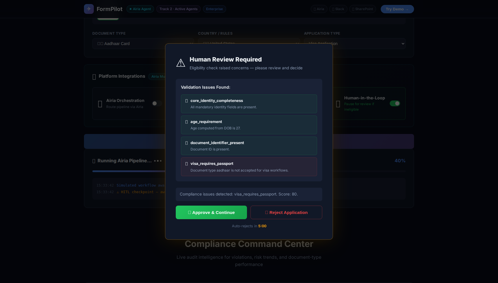

### 9) Post-HITL Completion After Approval
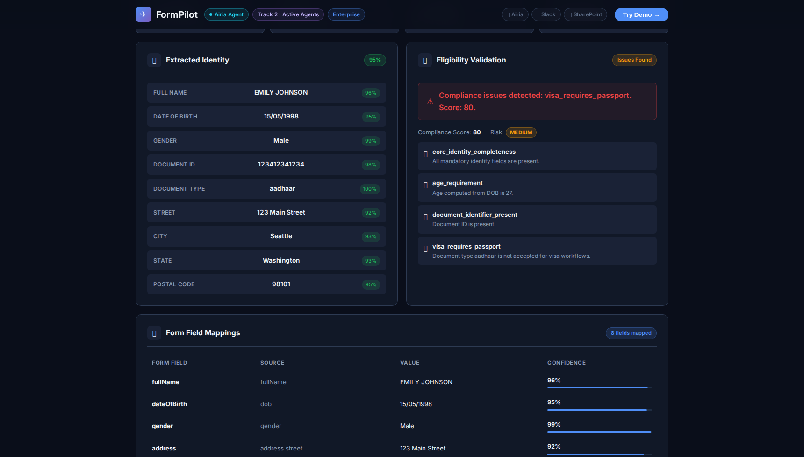

### 10) API Documentation (Operational Surface)
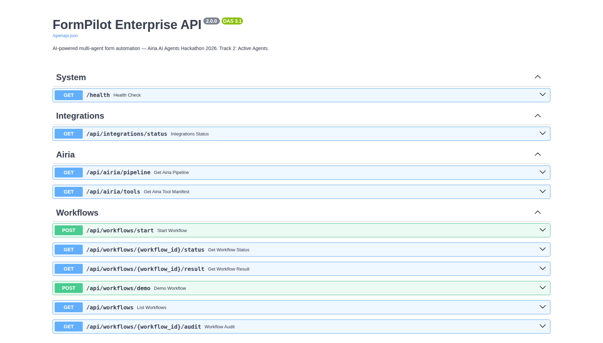

---

## Feature Coverage Checklist

- [x] Multi-agent 5-step pipeline definition and tool manifest
- [x] Multi-agent backend (Analyzer, Validator, Mapper, PDF)
- [x] Deterministic compliance engine (Aadhaar/GST/vehicle/property)
- [x] HITL approval/reject workflow with timeout behavior
- [x] Compliance dashboard and benchmark case-study endpoint
- [x] Persistent workflow store and audit trail (SQLite)
- [x] Slack and SharePoint integration hooks
- [x] Full web UI (no frontend build tooling required)
- [x] API docs and readiness checks
- [x] Automated tests passing

---

## Architecture Overview

```text
Uploaded Document
    -> Agent 1: Document Analyzer (Gemini Vision)
    -> Agent 2: Rules Validator (Deterministic compliance + optional AI narrative)
       -> HITL Gate (approve/reject/timeout)
    -> Agent 3: Field Mapper (semantic + fuzzy fallback)
    -> Agent 4: PDF Generator (ReportLab)
    -> Notification Dispatcher (Slack + SharePoint)
    -> Workflow persistence + audit events
```

Core modules:

- backend/main.py
- backend/workflows/form_automation_workflow.py
- backend/compliance/rule_engine.py
- backend/storage/workflow_store.py
- backend/integrations/orchestrator_client.py
- backend/integrations/slack_client.py
- backend/integrations/sharepoint_client.py

---

## Quick Start

### 1) Install

```bash
git clone https://github.com/pranjal2004838/Formpilot.git
cd Formpilot
pip install -r requirements.txt
```

### 2) Configure environment

```bash
cp .env.example .env
```

Minimum required for real model execution:

- GEMINI_API_KEY

Optional integrations:

- ORCHESTRATOR_API_KEY
- ORCHESTRATOR_PIPELINE_ID
- SLACK_WEBHOOK_URL
- SHAREPOINT_TENANT_ID
- SHAREPOINT_CLIENT_ID
- SHAREPOINT_CLIENT_SECRET
- SHAREPOINT_SITE_URL

### 3) Run app

```bash
cd backend
python main.py
```

Open:

- App: http://localhost:8000
- API docs: http://localhost:8000/docs

---

## Key API Endpoints

- GET /health
- POST /api/workflows/start
- GET /api/workflows/{id}/status
- GET /api/workflows/{id}/result
- GET /api/workflows/{id}/audit
- GET /api/workflows
- GET /api/compliance/dashboard
- GET /api/compliance/case-study
- GET /api/judge/readiness
- GET /api/integrations/status
- GET /api/orchestrator/pipeline
- GET /api/orchestrator/tools
- GET /api/pipeline/config
- GET /api/pipeline/tools

---

## Reproducing The Screenshot Walkthrough

The walkthrough screenshots in this README were generated automatically from a live app run.

```bash
# 1) Run backend
cd backend
python -m uvicorn main:app --host 127.0.0.1 --port 8000

# 2) In a second terminal, capture walkthrough
cd /workspaces/Formpilot
python scripts/capture_walkthrough.py
```

Outputs:

- assets/screenshots/
- assets/test-data/

---

## Test Status

```bash
cd /workspaces/Formpilot
pytest -q
```

Current result: **9 passed**.

---

## Enterprise Positioning Statement

FormPilot demonstrates a complete active-agent product loop, not just model inference:

- Real workflow state transitions
- Governance gates (HITL)
- Deterministic rule enforcement
- Operational dashboards
- Integrations for enterprise delivery channels
- Persistent compliance and audit metadata

This is ready to deploy as a highly credible enterprise automation system.

---

## Author

Built by **Pranjal Kumar Singh**

- GitHub: https://github.com/pranjal2004838
- Repository: https://github.com/pranjal2004838/Formpilot
